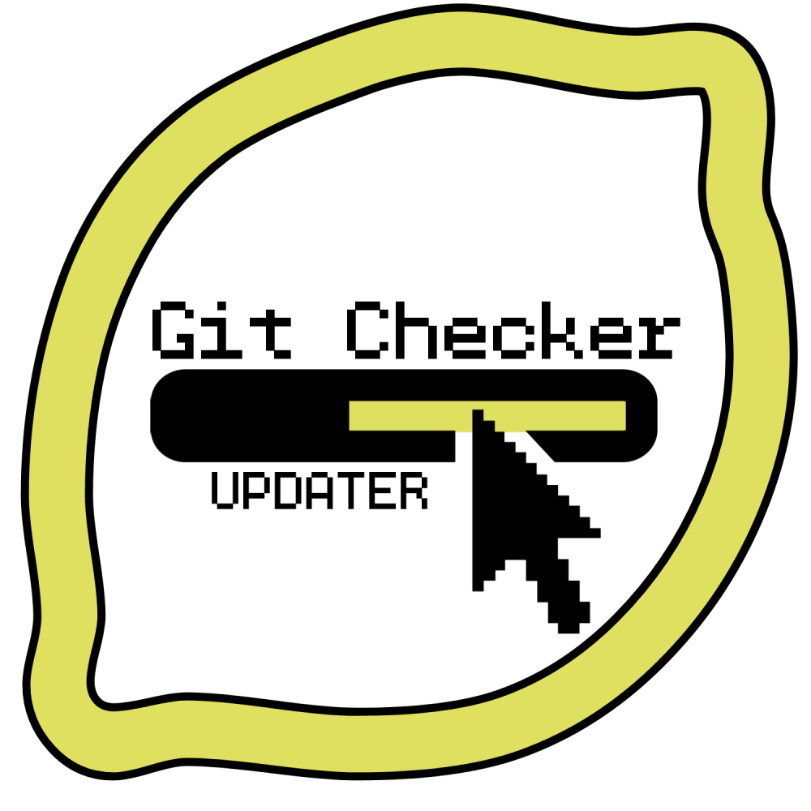

[![Contributors][contributors-shield]][contributors-url]
[![Forks][forks-shield]][forks-url]
[![Stargazers][stars-shield]][stars-url]
[![Issues][issues-shield]][issues-url]
[![MIT License][license-shield]][license-url]
[![LinkedIn][linkedin-shield]][linkedin-url]


<!-- PROJECT LOGO -->
<br />
<p align="center">
  <a href="https://github.com/yupipi93/gitChecker">
    
  </a>

  <h3 align="center">GIT CHECKER - [BASH]</h3>

  <p align="center">
    A simple bash script to automate the updating of your projects!
    <br />
    <a href="https://github.com/yupipi93/gitChecker"><strong>Code »</strong></a>
    <br />
    <br />
    <a href="https://github.com/yupipi93/gitChecker/issues">Report Bug</a>
    ·
    <a href="https://github.com/yupipi93/gitChecker/issues">Request Feature</a>
  </p>
</p>


<!-- ABOUT THE PROJECT -->
## About The Project

GitChecker detects changes in your Git repository and lets you set up actions before, during, and after the project is updated.

A recurring use case for GitChecker is when we have the backend of our app hosted on a server where we want to up updates constantly.
GitChecker will detect the new changes in the repository and update the code with them.

All you have to do is upload the changes to your branch and GitChecker will do the rest.


### Built With

* [Bash](https://en.wikipedia.org/wiki/Bash_(Unix_shell))
* [Git](https://git-scm.com/)


<!-- GETTING STARTED -->
## Getting Started

To get started, download GitChecker from this repository and copy it to your repository's root folder.
(We recommend downloading the zip and extracting it, not cloning it)

It is usually used in the production branch, when the code is on a remote server.

To run it, you need to go into the gitChecker folder and run ./gitChecker.sh

you can run 
```sh
./gitChecker.sh -h 
```
to display help.

```
Syntax: ./gitChecker.sh [OPTIONS]
OPTIONS:
-b 'branch'   Branc name to check updates.    [DEFAULT:current]
-p 'path'     Path of repository folder.      [DEFAULT:..]
-u 'update'   Update time in minutes          [DEFAULT:10]
-h            Print this Help.
```

If you do not add any parameters, it will take the default values.
The opposite case, you can configure:

The branch where the changes are expected (usually the production branch)
Example: 
```sh
./gitChecker.sh -b production
```

The path where the target repository is located (you don't need to configure it if you put gitChecker into the root folder)
Example: 
```sh
./gitChecker.sh -p /home/USERNAME/MyRepo/
```

The waiting time between updates (default 10 minutes)
Example: ./gitChecker.sh -u 1 (will check for updates every 1 minute)

If we want to force the update (default merged)
Example 
```sh
./gitChecker.sh -force
```

Complete example: 
```sh
./gitChecker.sh -b production -p /home/USERNAME/MyRepo/ -u 1 -force
```

Translated with www.DeepL.com/Translator (free version)

You can choose the update method: Merged or Forced.
Merged: Merges local changes with remote changes. (may cause conflicts)
Forced: Discards local changes.

<!-- Footer -->

[](http://creativecommons.org/publicdomain/zero/1.0/)

<!-- MARKDOWN LINKS & IMAGES -->
<!-- https://www.markdownguide.org/basic-syntax/#reference-style-links -->
[contributors-shield]: https://img.shields.io/github/contributors/yupipi93/gitChecker.svg?style=flat-square
[contributors-url]: https://github.com/yupipi93/gitChecker/graphs/contributors
[forks-shield]: https://img.shields.io/github/forks/yupipi93/gitChecker.svg?style=flat-square
[forks-url]: https://github.com/yupipi93/gitChecker/network/members
[stars-shield]: https://img.shields.io/github/stars/yupipi93/gitChecker.svg?style=flat-square
[stars-url]: https://github.com/yupipi93/gitChecker/stargazers
[issues-shield]: https://img.shields.io/github/issues/yupipi93/gitChecker.svg?style=flat-square
[issues-url]: https://github.com/yupipi93/gitChecker/issues
[license-shield]: https://img.shields.io/badge/License-CC0%201.0-lightgrey.svg?style=flat-square
[license-url]: https://github.com/yupipi93/gitChecker/blob/master/LICENSE.txt
[linkedin-shield]: https://img.shields.io/badge/-LinkedIn-black.svg?style=flat-square&logo=linkedin&colorB=555
[linkedin-url]: https://linkedin.com/in/sergio-conejero-vicente-61226aa5/
[product-screenshot]: images/screenshot.png

