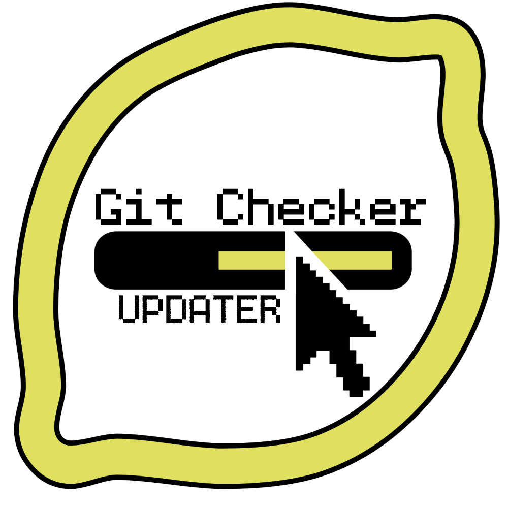

[![Contributors][contributors-shield]][contributors-url]
[![Forks][forks-shield]][forks-url]
[![Stargazers][stars-shield]][stars-url]
[![Issues][issues-shield]][issues-url]
[![MIT License][license-shield]][license-url]
[![LinkedIn][linkedin-shield]][linkedin-url]


<!-- PROJECT LOGO -->
<br />
<p align="center">
  <a href="https://github.com/yupipi93/gitChecker">
    
  </a>

  <h3 align="center">GIT CHECKER - [BASH]</h3>

  <p align="center">
    A simple bash script to automate the updating of your projects!
    <br />
    <a href="https://github.com/yupipi93/gitChecker"><strong>Code »</strong></a>
    <br />
    <br />
    <a href="https://github.com/yupipi93/gitChecker/issues">Report Bug</a>
    ·
    <a href="https://github.com/yupipi93/gitChecker/issues">Request Feature</a>
  </p>
</p>


<!-- ABOUT THE PROJECT -->
## About The Project

GitChecker detects changes in your Git repository and lets you set up actions before, during, and after the project is updated.  

A recurring use case for GitChecker is when we have the backend of our app hosted on a server where we want to up updates constantly.
GitChecker will detect the new changes in the repository and update the code with them.  

All you have to do is upload the changes to your branch and GitChecker will do the rest.  


### Built With

* [Bash](https://en.wikipedia.org/wiki/Bash_(Unix_shell))
* [Git](https://git-scm.com/)


<!-- GETTING STARTED -->
## Getting Started

To get started, download GitChecker from this repository and copy it to your repository's root folder.  
(We recommend downloading the zip and extracting it, not cloning it)


It is usually used in the production branch, when the code is on a remote server.  

To run it, you need move into your root folder repository, and write the next command.  
The script will ask you for your git credentials and start the process.
```sh
./gitChecker/gitChecker.sh
```

But surely you prefer to show the help first. 
```sh
./gitChecker/gitChecker.sh -h 
```

```
Syntax: ./gitChecker.sh [OPTIONS]
OPTIONS:
-b 'branch'   Branc name to check updates.        [DEFAULT:current]
-p 'path'     Path of repository folder.          [DEFAULT:..]
-u 'update'   Update time in minutes.             [DEFAULT:10]
-m            Merge update. Merge local files.    [DEFAULT:force]
-r            Remove config (name,email,credentials)
-h            Print this Help.
```

IIf you don't add any parameter, it will take the default values.  
The opposite case, you can configure:

**Establishing the branch where changes are expected**  
Flag: [-b] branch  
Note: Normally the production branch is taken.  
By default: Will take the current branch in repo.  
Example:  
```sh
./gitChecker/gitChecker.sh -b production
```

**Establishing the path where the target repository is located**  
Flag: [-p] path  
Note: You don't need to configure it if you put gitChecker into the root repo folder.  
By default: Will take the ./ repository.  
Example:  
```sh
./gitChecker/gitChecker.sh -p /home/USERNAME/MYREPO/
```

**Establishing time between updates.**  
Flag: [-u] update_time  
Note: The unit is in minutes.  
By default: 10 minuts  
Example:  
```sh
./gitChecker/gitChecker.sh -u 1
```

**Establishing the update method**  
Flag: [-m]  
Note: You can choose between forced or merged.    
Force: Discards local changes. (Recomended)
Merge: Merges local changes with remote changes. (may cause conflicts)  
By default: Force method   
Example:  
```sh
./gitChecker/gitChecker.sh -m
```

**Concatenating flags**  
Example:   
```sh
./gitChecker/gitChecker.sh -b production -p /home/USERNAME/MyRepo/ -u 1 -m
```


<!-- SETTING -->
## SETTING
**Adding your config**  

PIPELINE:  
Execute start actions (first time)  
Check for updates  
  Stop actions  
  Update Proyect  
  Start options  
Check for updates  
...  


You should edit the **startAction.sh** and **stopAction.sh** files to add your own commands  
**startAction.sh** example:
```sh
#########################
####  START ACTIONS  ####
#########################
#WRITE HERE YOUR CODE
```

**stopAction.sh** example:
```sh
#########################
####  STOP ACTIONS   ####
#########################
#WRITE HERE YOUR CODE
```

In the file "START ACTIONS" add the commands you want to execute first time and after each update, for example install dependences and start the server again.

In the file "STOP ACTIONS" add the commands you want to execute before the update, for example stopping the server.  

**startAction.sh** example:
```sh
#########################
####  START ACTIONS  ####
#########################
npm i
docker-compose up
```

**stopAction.sh** example:
```sh
#########################
####  STOP ACTIONS   ####
#########################
docker-compose stop
```

<!-- SETTING -->
## FILES
**These files and folders are not necessary for the execution**  
README.md  
LICENSE.txt  
images/  


<!-- LICENSE -->
## License

Public Domain.  
Distributed under CC0 License. See `LICENSE.txt` for more information.  
Free for all :D  


<!-- CONTACT -->
## Contact

Sergio Conejero Vicente - [@twitter_handle](https://twitter.com/Yupipi93) - yupipi93@gmail.com

Project Link: [https://https://github.com/yupipi93/gitChecker](https://https://github.com/yupipi93/gitChecker)


<!-- Footer -->

[](http://creativecommons.org/publicdomain/zero/1.0/)

<!-- MARKDOWN LINKS & IMAGES -->
<!-- https://www.markdownguide.org/basic-syntax/#reference-style-links -->
[contributors-shield]: https://img.shields.io/github/contributors/yupipi93/gitChecker.svg?style=flat-square
[contributors-url]: https://github.com/yupipi93/gitChecker/graphs/contributors
[forks-shield]: https://img.shields.io/github/forks/yupipi93/gitChecker.svg?style=flat-square
[forks-url]: https://github.com/yupipi93/gitChecker/network/members
[stars-shield]: https://img.shields.io/github/stars/yupipi93/gitChecker.svg?style=flat-square
[stars-url]: https://github.com/yupipi93/gitChecker/stargazers
[issues-shield]: https://img.shields.io/github/issues/yupipi93/gitChecker.svg?style=flat-square
[issues-url]: https://github.com/yupipi93/gitChecker/issues
[license-shield]: https://img.shields.io/badge/License-CC0%201.0-lightgrey.svg?style=flat-square
[license-url]: https://github.com/yupipi93/gitChecker/blob/master/LICENSE.txt
[linkedin-shield]: https://img.shields.io/badge/-LinkedIn-black.svg?style=flat-square&logo=linkedin&colorB=555
[linkedin-url]: https://linkedin.com/in/sergio-conejero-vicente-61226aa5/
[product-screenshot]: images/screenshot.png

